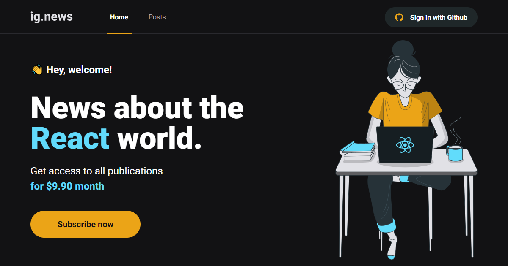

<h1 align="center">
    
</h1>

<br>

## 🧪 Tecnologias

Esse projeto foi desenvolvido com as seguintes tecnologias:

- [Next](https://nextjs.org/)
- [Typescript](https://www.typescriptlang.org/)
- [Prismic](https://prismic.io/)
- [Stripe](https://stripe.com/)
- [Faunadb](https://fauna.com/)
- [NextAuth](https://next-auth.js.org/)
- [Jest](https://jestjs.io/pt-BR/)

## 🚀 Como executar

Clone o projeto e acesse a pasta do mesmo.

```bash
$ git clone https://github.com/daniilomello/daniilodev.git
$ cd daniilodev
```

Para iniciá-lo, siga os passos abaixo:

```bash
# Crie um conta no Stripe, e atualize o arquivo .env.local
# com as chaves geradas pelo Stripe
STRIPE_API_KEY=
NEXT_PUBLIC_STRIPE_PUBLIC_KEY=
STRIPE_SUCCESS_URL=http://localhost:3000/posts
STRIPE_CANCEL_URL=http://localhost:3000/
```

```bash
# Instale a CLI do Stripe e inicilize para gerar um chave de Webhook
# e atualize no arquivo .env.local
STRIPE_WEBHOOK_SECRET=
```

```bash
# Crie um conta no Github e crie um novo app de autenticação
# Adicione o client secret e id, gerado pelo Github no arquivo .env.local
GITHUB_ID=
GITHUB_SECRET=
```

```bash
# Crie um conta no Faunadb, adicione a key gerado no arquivo .env.local
FAUNADB_KEY=
```

```bash
# Crie um conta no Prismic, adicione endpoint e token gerado no arquivo .env.local
PRISMIC_ENDPOINT=
PRISMIC_ACCESS_TOKEN=
```

```bash
# Instalar as dependências
$ yarn

# Iniciar o projeto
$ yarn start
```
O app estará disponível no seu browser pelo endereço http://localhost:3000.


## 💻 Projeto

Site de notícias para assinantes, com conteúdo bloqueado e prévia pública para otimização de SEO.


## 📝 License

Esse projeto está sob a licença MIT.

---

Feito com 💜 by Danilo Mello 👋🏻
